# ML-and-Data-Mining

## Project Definition

Machine learning and data mining can be used to gain insights and derive knowledge from seemingly arbitrary data. This project aims to apply a number of these techniques across two contrasting datasets to answer dataset specific questions, while also demonstrating the suitability of different techniques for different data structures.

Bank Notes <https://www.kaggle.com/ritesaluja/bank-note-authentication-uci-data>

The first dataset to be considered is “Bank Notes”. It is composed of image data that was taken from genuine and forged banknote-like specimens.  According to the Bank of England, in 2019, around 427,000 counterfeit Bank of England banknotes with a face value of £9.8 million were taken out of circulation. Therefore, having a system that can identify genuine notes with a high probability is extremely important, as in most nations around the world the use of cash is still widespread. Models will be constructed to take the input fields and then label each note as either “real” or “fake”. The data dictionary, showing the initial 5 attributes for this dataset, is presented in figure 1.

Start-ups <<https://www.kaggle.com/arindam235/startup-investments-crunchbase>>

The second dataset is “Start-ups”, which relates to VC funding and start-ups investment information extracted from Crunchbase. The information entails the country, region, city, funding rounds, funding amount, market and many other useful parameters at a company level. The company status is also included for each listed start-up, showing whether it remains acquired, operational or closed. In Venture Capital accurately identifying a start-up that has a high probability of succeeding in the future is crucial in order to minimise risk and maximise ROI. As a result, a machine learning approach will be applied to build models that can identify the potential of start-ups, classifying whether they are expected to be acquired, operational or closed. The data dictionary, showing the initial 39 attributes for this dataset, is presented in figure 2.

As stated above, both problems require algorithms that can perform classification to solve the data specific questions. The algorithms that have been selected are Decision tree, Random forest, Neural Network (Multi-Layer Perceptron), Logistic Regression, Naive Bayesian Learning and Support Vector Machine. These will be compared through their performance in terms of predictive accuracy, precision, recall and F1-score  It is expected that the contrasts in these datasets will allow for meaningful comparisons to be made between the performances of our chosen techniques in different environments and highlight strengths and weaknesses. The differences that are likely to have an effect are the type of classification: binary (Bank Notes) and ternary (Start-ups), the balance/imbalance of target classifications and the number of input features (dimensionality): few (4 for Bank Notes) and many (38 initially for Start-ups, likely to drop significantly before modelling) . 

 

*Figure*  1 Bank Notes Data Dictionary*

|**Field name**|**Data type**|**Description**|
| :- | :- | :- |
|Variance|` `Numeric (float)|` `Variance of Wavelet Transformed image|
|Skewness|` `Numeric (float)|` `Skewness of Wavelet Transformed image|
|Curtosis|` `Numeric (float)|` `Curtosis of Wavelet Transformed image|
|Entropy|` `Numeric (float)|Entropy of Wavelet Transformed image |
|Class|` `Numeric (integer)|` `Binary representation of classes (0- genuine, 1-forged)|

*Figure*  2 Start Ups Data Dictionary*

|**Field name**|**Data type**|**Description**|
| :- | :- | :- |
|Permalink|` `String|` `Permalink for the company on CrunchBase|
|Name|` `Object (string)|` `Name of the company|
|Homepage URL|` `Object (string)|` `Web address of the company’s homepage|
|Category List|` `Object (string)|Category of the company|
|Market|` `Object (string)|` `Market that the company is in|
|Funding Total USD|` `Object (string)|` `Total funding received (US dollars)|
|Status|Object (string)|` `Status of the company (acquired, operating or closed)|
|Country Code|` `Object (string)|` `Nationality of the company (represented by 3 letter country code)|
|State Code|** Object (string)|** State location- for US companies (represented by 2 letter state code)|
|Region|` `Object (string)|` `Region of the company|
|City|` `Object (string)|` `City of the company|
|Funding Rounds|` `Numeric (integer)|` `Number of funding rounds|
|Founded at|` `Object (DateTime)|` `Date that the company was founded (DD/MM/YYYY)|
|Founded Month|` `Object (DateTime)|` `Month that the company was founded (YYYY-MM)|
|Founded Quarter|` `Object (string)|` `Quarter that the company was founded (year-quarter)|
|Founded Year|` `Numeric (float)|` `Year that the company was founded|
|First Funding at|` `Object (DateTime)|` `Date of first funding (DD/MM/YYYY)|
|Last Funding at|` `Object (DateTime)|` `Date of last funding (DD/MM/YYYY)|
|Seed|` `Numeric (integer)|` `Initial “seed” capital invested|
|Venture|` `Numeric (integer)|` `Amount received from Venture Capitalists|
|Equity Crowdfunding|` `Numeric (integer)|` `Amount raised from Equity Crowdfunding|
|Undisclosed|` `Numeric (integer)|` `Amount received from undisclosed sources|
|Convertible Note|` `Numeric (integer)|` `Amount raised through convertible notes|
|Debt Financing|` `Numeric (integer)|` `Amount raised through debt financing|
|Angel|` `Numeric (integer)|` `Amount received from Angel investors|
|Grant|` `Numeric (integer)|` `Amount received through grants|
|Private Equity|`  `Numeric (integer)|` `Amount of private equity|
|Post OPI Equity|`  `Numeric (integer)|` `Equity after initial public offerings|
|Post OPI Debt|`  `Numeric (integer)|` `Debt after initial public offerings|
|Secondary market|`  `Numeric (integer)|` `Amount raised in secondary market|
|Product Crowdfunding|`  `Numeric (integer)|` `Amount raised through product crowdfunding|
|Round A|`  `Numeric (integer)|` `Amount raised in venture round A |
|Round B|`  `Numeric (integer)|` `Amount raised in venture round B |
|Round C|`  `Numeric (integer)|` `Amount raised in venture round C |
|Round D|`  `Numeric (integer)|` `Amount raised in venture round D|
|Round E|`  `Numeric (integer)|` `Amount raised in venture round E|
|Round F|`  `Numeric (integer)|` `Amount raised in venture round F|
|Round G|`  `Numeric (integer)|` `Amount raised in venture round G|
|Round H|`  `Numeric (integer)|` `Amount raised in venture round H|

## Data Preparation, Pre-processing and Exploration

### Bank Notes

This dataset was found on Kaggle and was downloaded as a CSV file. This was then loaded into the workspace as a data frame. This dataset had already been significantly prepared, features have been extracted from grayscale 400x400 pixel images, using the Wavelet Transform tool. The data was checked for null values, however there appeared to be none.

For the Bank Note data, the set of features show signs of correlation. This is important as training a model on a set of features with no or very little correlation will get inaccurate results (Chatterjee, 2017). The heat map (Figure3) of the correlation between features is dominated by negative correlations. For example, there is a strong negative correlation between variance and class. This means that notes with a lower variance are more likely to be genuine. Furthermore, skewness shares a moderate negative correlation with class. Once again showing that a lower value means that the bank note is generally genuine. On the other hand, curtosis and entropy have no correlation with class. There is also a moderate negative correlation between skewness/curtosis and entropy/skewness. 

*Figure* 3 Bank Notes: Correlation Matrix (Heatmap)*

Figure 4 shows a scatter matrix for the pairs of features however, the data points have been split into genuine and forged. Red data points represent forged bank notes whereas blue data points represent genuine bank notes. Both genuine and forged bank notes have very similar distributions of data points. The variance and skewness of forged bank notes is generally larger than that of genuine bank notes, but the entropy is very similar. The curtosis of the bank note has a larger range for genuine than forged.

*Figure*  4 Bank Notes: Scatter Matrix*

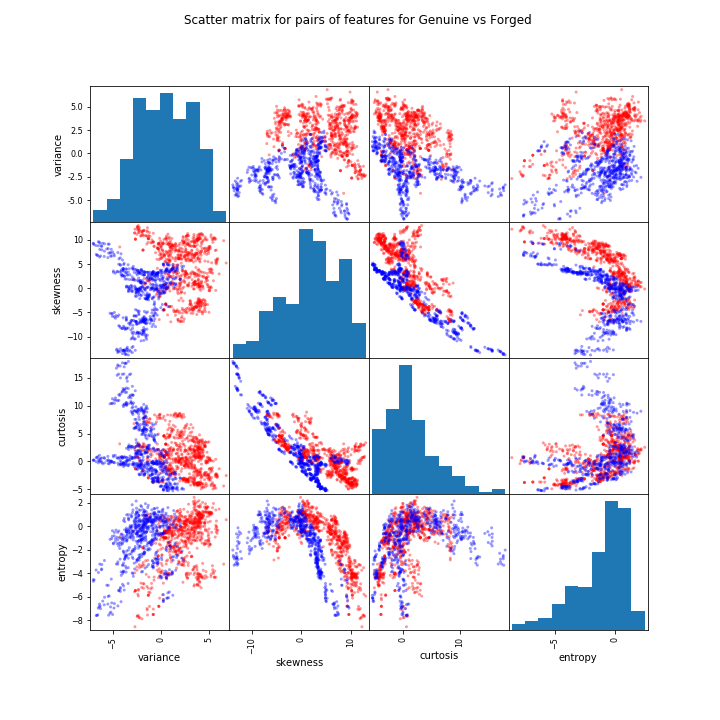

From Figure 5 it is evident that entropy has the lowest range and interquartile range of all the features. This could indicate it is hard to tell whether a bank note is genuine or forged from entropy. On the other hand, skewness has the largest range and interquartile range. This could indicate that it is easy to tell the class of the banknote from its skewness. Skewness also has the largest upper quartile and median. Curtosis has a lot of large value outliers whereas entropy has a lot of small value outliers. Furthermore, curtosis has the largest lower quartile.

*Figure*  5 Bank Notes: Box Plots for Attributes*

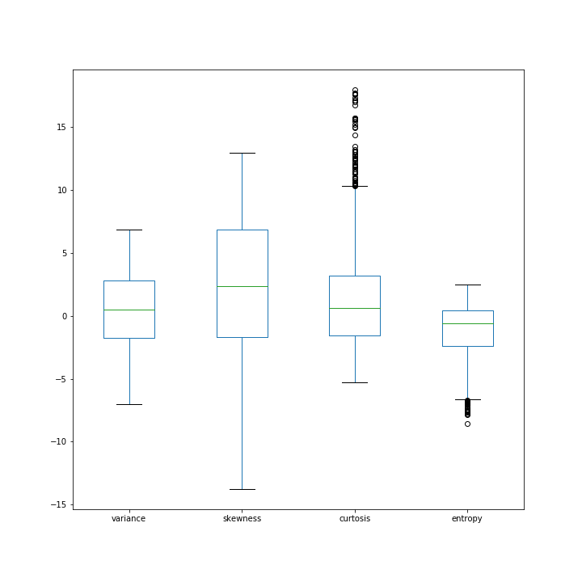

The histograms in Figure 6 show that entropy is skewed to the left and thus is negatively skewed. It is clear that most banknotes have a large entropy. Curtosis is skewed to the right and thus is positively skewed. This means that most banknotes have a small entropy value. In addition, skewness and variance are very slightly skewed to the left and therefore negatively skewed. However, they are both bordering on random. The data is mostly situated towards the middle of the histogram for these two. The class histogram indicates the amount of forged and genuine banknotes as two different bars, it shows that the target field is well-balanced. There are 762 class 0 (genuine) and 610 class 1 (counterfeit), this is likely to have a positive impact on the performance of classifiers.

*Figure*  6 Bank Notes: Attribute Histograms*

When it came to the selection of features to use for modelling it was essential to choose features that could potentially influence whether a banknote was genuine or forged. From the exploration of the banknote data it was clear that variance and skewness showed a correlation with the target feature class. However, as the dataset contained only numeric fields and only four potential features to choose from to yield the greatest accuracy possible, variance, skewness, curtosis and entropy were all used in the modelling process.

Start-ups

This dataset was also found on Kaggle and was downloaded as a CSV file. This was then loaded into the workspace as a data frame. In contrast to the “Bank Notes” dataset, this dataset required a considerable amount of preparation to be made suitable for modelling. Histograms of some of the fields are produced to provide an overview of the data (Figure 7).

*Figure*  7 Start-ups: Attribute Histograms*

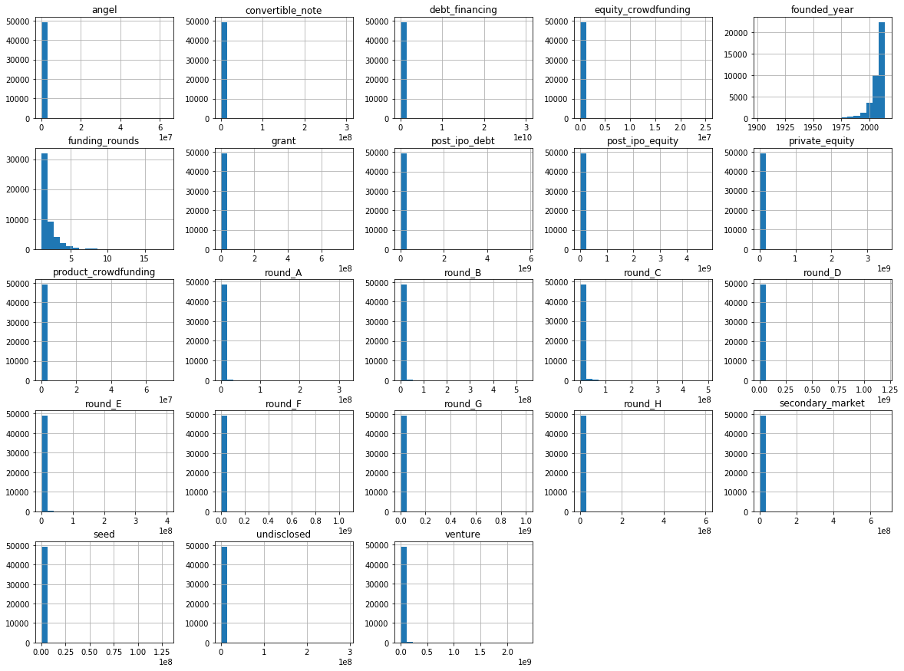

By reviewing the founded year for start-ups listed within the data frame, it was found that the minimum value was set at 1902, and the maximum year was 2014. This time period is quite large, potentially skewing the data. Central tendency of the years closely sits towards the year 2007, whereas the 75 percent lies within the year 2012, 25% lies within the year 2006, and 50% lies within 2010. In light of this information, it is shown that the mass of the distribution is concentrated on the right of Figure 8.

*Figure*  8 Start-Ups: Distribution of Founded Year*

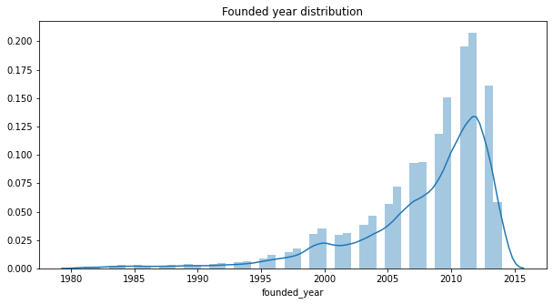

The top 5 countries are the USA, Great Britain, Canada, China & Germany. These top countries' composition of start-ups was the greatest relative to others (shown in Figure 9). Out of all the start-ups distributed across the world it seems that 86.9% are all operating whereas a small number of them are either acquired or closed (shown in Figure10). The significant imbalance of the data is likely to have an impact on the performance of classifiers.

*Figure*  9 Start-Ups: Status of Start-Ups in Top-5 Countries*

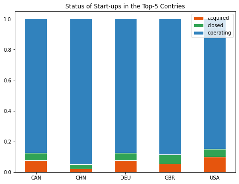

*Figure*  10 Start-Ups: Doughnut chart of Statuses*

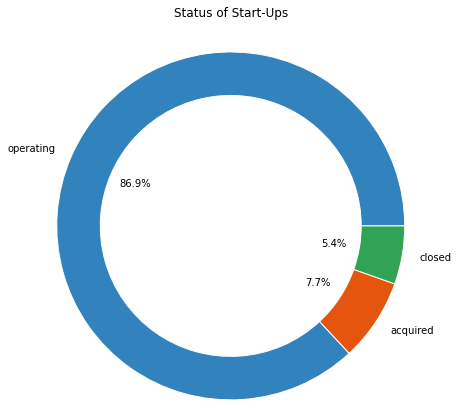

Figure 11 represents the top 10 markets across the globe, and the number of start-ups within those markets too. The majority of the dataset is composed of start-ups within the software industry, almost amounting to over 4000. Figure 12 shows how these industries are represented within the top 4 countries.

*Figure*  11 Start-Ups: Global Top 10 Market Counts*

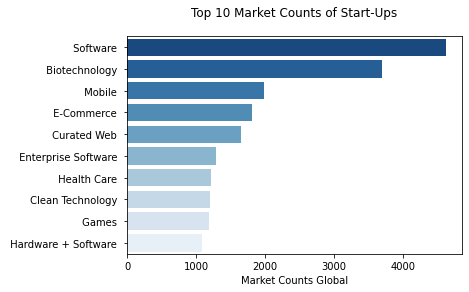

*Figure*  12 Start-Ups: Top 10 Market Counts for Top 4 Countries*

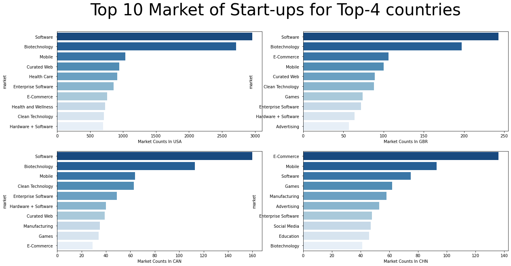

The aim of this classification model is to accurately identify start-ups which may eventually be successful or not. As such the target variable chosen is status, companies in the past may have either been acquired, or are still operating, or currently closed for business. It seems that from the dataset the top 10% companies acquire 73.5% of total funding (Figure 13). The average companies that were acquired lasted through 2.5 funding rounds, whereas companies with a status of operating or closed had an average below that (Figure 14).

*Figure*  13 Start-Ups: Doughnut Chart for Funding of Top 10%*

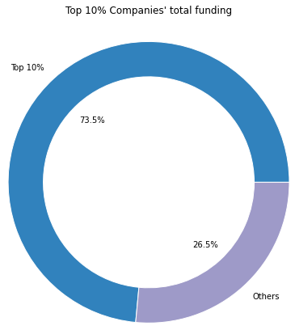

*Figure*  14 Start-Ups: Box Plot for Funding Rounds*

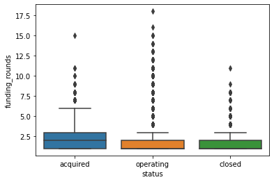

The number of initial features amount to 39 columns, of which contain several null values too. Deleting a particular row or a column with no specific information is better, since it does not have a high weightage. On the other hand, if the degree of correlation between variables is high enough, it can cause problems if you fit the model and interpret the results (Frost, 2020). This heat map (Figure 15) visualises the correlation between the features, in this situation the majority of the correlations aren’t portrayed highly and provide less classifying power to our ML model. Thus, the number of rows containing null values which also contribute to this low correlation had to be removed, to be exact Number of rows dropped due to null values:  49438 (original rows) - 34492 (old rows) = 14946. The final training set contained the following attributes: Market, Country Code, Funding Total USD and Funding Rounds. The target attribute, as mentioned previously, is Status.

*Figure*  15 Start-Ups: Correlation Matrix*

## Model Development and Evaluation

The questions that have been formulated for both datasets are structured as classification problems. As a result, modelling methods that can perform classification have been used. The following methods have been selected: Decision trees, Random forest, Neural Networks (MLP), Logistic Regression, Naive Bayesian Learning and Support Vector Machines.

### Decision Tree (DT) - Description

A decision tree is a decision support tool that uses a tree-like graph or model of decisions and their possible consequences, including chance event outcomes, resource costs, and utility (Brid, 2018). It can demonstrate an algorithm that contains only conditional control statements. Within the decision tree each of its internal nodes represents a choice on an attribute. The branches represent the outcome of the choice made in the internal node and finally each leaf node is a class label. This means that the routes taken from root to leaf of a decision tree show classification rules. Decision trees can be used for both classification and regression problems as well as numeric and categorical inputs. They are also one of the most used supervised learning methods and have the ability to solve linear and nonlinear problems.

### Random Forest (RF) - Description

Random forests are used for classification and regression. They are an ensemble learning method made up of a number of decision trees that are training at the same time. The output is the mean prediction of individual trees for regression and the mode of the classes for classification.

### Evaluation of Decision Tree/Random Forest Algorithm

Using decision trees can be very advantageous. For example, they are easy to understand and useful in data exploration. This means that prior knowledge of decision trees is not needed to interpret them, and it is easy to spot the most significant variables and relationships between variables. Additionally, due to decision trees not being affected by outliers to a decent degree there is less data cleaning required to create a good model. Finally feature selection is performed implicitly. 

The main disadvantage with decision trees is overfitting. Overfitting occurs when over-complex trees are created that do not generalise well. However, this can be overcome by pruning and setting constraints. A second disadvantage is that trees can become dominated by classes if there is an imbalance in the data set. If the data set contains continuous numerical variables, the decision tree loses information, when it categorises variables in different categories (Brid, 2018).

### Multilayer Perceptron (MLP)

A multilayer perceptron is a type of artificial neural network made up of a number of perceptrons, stacked in several layers, to solve complex problems (MissingLink, 2020). An artificial neural network is a computer system roughly inspired by the human brain. Which means the system ‘learns’ to perform tasks. A multilayer perceptron is made up of three layers. All of the perceptrons in the first layer, often called the input layer, sends its outputs to all of the perceptrons in the second layer, the hidden layer. The perceptrons in the hidden layer then sends outputs to the final layer, the output layer. However, there can be more than one hidden layer. Each perceptron sends multiple signals and one signal goes to each perceptron in the next layer (MissingLink, 2020). Perceptrons work by taking their input and multiplying it by their weight. A bias factor is then added and then the sum is fed through the activation function. The result is then the perceptron output. An example of a common activation function is the sigmoid function. The sigmoid function is commonly used because it exists between 0 and 1. So it is useful in models where the output is a predicted probability.

Multilayer perceptrons have an array of advantages, firstly the layers are fully connected, and each perceptron is connected with every other perceptron. Secondly, the algorithm used for multilayer perceptrons is very useful for both regression and mapping. A multiple dimensional input signal can be mapped to a multi-dimensional output signal. This can be linear or nonlinear.

On the other hand, multilayer perceptrons have quite a few disadvantages. There is a disregard for spatial information as the algorithm takes flattened vectors as inputs and the total number of parameters can increase to very high numbers. Furthermore, multilayer perceptrons are insufficient for advanced computer vision tasks and have thus been succeeded by convolutional neural networks. Another limitation of the algorithm is that underfitting may occur if the number of hidden neurons is set too low and overfitting may occur if it is set too high. Finally, the main disadvantage of the multilayer perceptron algorithm is that it is not always guaranteed that the minima the algorithm comes to a halt at during training is the global minima.

### Logistic Regression (LR)

Logistic regression is an algorithm used for classification to attach certain observations to a discrete set of classes. Using the logistic sigmoid function logistic regression is able to transform its output into a probability value. This value can then be assigned to two or more discrete classes. It measures the relationship between the one or more independent variables and the dependent variable that we want to predict. There are three types of logistic regression: binary, multi and ordinal. Binary has two outputs e.g. pass or fail. Multi can have three or more outputs e.g. apples, pears or oranges. Ordinal can have three or more outputs but in this case the output is something like low, medium or high.

A couple positives of the logistic regression algorithm are that it is very efficient and is not very computationally expensive. Also, it is very interpretable and input features being scaled is not required. Finally, the predicted probability outputs are well calibrated, and the algorithm is easy to regularise. These benefits mean that logistic regression can be used as a good baseline to measure the performance of other algorithms.

A negative of logistic regression includes its lack of ability to solve nonlinear problems. This is because it has a linear decision surface. Furthermore, it can only predict a categorical outcome. Another negative is that it has a high dependability on the state of the data set. In other words, the important features must be already identified. Logistic regression is also not as powerful as some of the more complex algorithms and therefore can be outperformed with ease.

###  Naive Bayesian Learning (NB)

The Naive Bayes classifier is based on the Bayes theorem used in probabilistic machine learning models for classification tasks.

Bayes Theorem: P(A|B) = P(B|A)P(A) / P(B)

This assumes that a feature is unrelated to any other feature. 

Using Naive Bayes algorithm, it is fast and easy to predict the class of the test data set. In addition, multi class predictions have a high performance using Naive Bayes. Another advantage is that when independence is present the classifier outperforms other models like logistic regression and you need less training data (Ray, 2017). 

A huge limitation of Naive Bayes is the assumption of independent predictors. In most real-life cases, the predictors are dependent, so this hinders the performance of the classifier (Gandhi, 2018). Also, Naive Bayes has been known to be a bad estimator. Which means the probability outputs should not be considered too seriously.

### Support Vector Machine (SVM)

A support vector machine is a supervised machine learning method used for regression and classification. The objective of the support vector machine algorithm is to find a hyperplane in an N-dimensional space that distinctly classifies the data points (Gandhi, 2018). A hyperplane otherwise known as a decision boundary is a boundary that helps to classify certain data points. Two classes of data points are separated by a hyperplane however, there are many hyperplanes that could be chosen. The goal is to find a hyperplane that has the maximum margin. A maximum margin is the maximum distance between data points of two or more classes. Having a larger margin distance means that there is some reinforcement so that data points can be classified with a higher amount of certainty in the future. 

An advantage of support vector machines is that they are very effective in high dimensional spaces. This contributes to the fact that even when the number of samples is less than the number of dimensions, support vector machines remain effective. Support vector machines have also been described as memory efficient. This is due to using subsets of training points in the decision function often called support vectors.

There are two main disadvantages of support vector machines. Firstly, if the number of samples is much less than the number of features overfitting can take place. Secondly, probability estimates are not directly provided but they can be calculated using a k-fold cross validation.

Both models are evaluated through performance metrics, predictive accuracy, precision, recall and f1-score.; ROC is calculated for Bank Notes only. 10-fold cross-validation is used to test and train the models and generate averages of these ‘scores, this ensures that a good representation of the data is considered overall.

### Predictive Accuracy

Predictive accuracy is a simple and commonly used metric, it gives a single value that gives the percentage of correctly classified data points. Accuracy can be misleading for imbalanced datasets so the results will be carefully considered, and care will be taken, especially for the “Start-ups”, when perceiving a high accuracy to be an indication of strong performance. Nonetheless it is selected as it is easily interpretable.

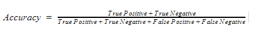

### Precision

Precision talks about how accurate your model is out of those predicted positive, how many of them are actual positive (Shung, 2018). Precision is extremely useful in email spam detection. This is because it is a good measure to determine the cost of false positives.

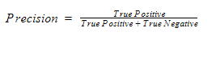

### Recall

Recall is a method of calculating how many actual positives the model records. This means that recall should be the model metric selected if there is a large cost linked with false negatives. Uses include fraud detection and sick patient detection.

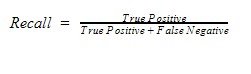

### F1-Score

F1 Score is appropriate for use when you want to find a balance between recall and precision. To add to this if there is a large number of actual negatives as well then F1 score might be a better measure to use than accuracy.

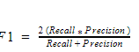

### ROC

The ROC (receiver operating characteristics) curve is a useful metric used with binary classifiers. It plots the true positive rate (recall) against the false positive rate (FPR). The FPR is the ratio of negative instances that are incorrectly classified as positive. It is equal to 1 - the true negative rate (TNR also known as specificity), which is the ratio of negative instances that are correctly classified as negative. Therefore, the ROC curve plots sensitivity (recall) against 1-specificity. It is important to note that a trade-off exists between TPR and FPR. The higher the recall (TPR), the more false positives the classifier produces (FPR).

The straight diagonal line in the chart represents the ROC curve of a random classifier. The further away the plot of a classifier from that line (toward the top-left corner), the better the classifier.

Furthermore, the area under the curve (AUC) is also another useful tool to compare classifiers. A perfect classifier will have a ROC AUC equal to 1, while for a purely random one it will be equal to 0.5.

## Result Collection and Interpretation

### Bank Notes

Figure 16 shows a summary of the performance metrics for each of the 6 classifiers. 5 out of 6 of the classifiers were able to produce extremely strong performances across all the evaluation measures. RF was able to achieve a perfect (rounded) F1-score of 1.00 on both classes, with DT, NB, SVM and MLP averaging 0.99 F1-scores. Naive Bayesian was the lowest performing across all metrics. The dataset is well balanced so in this case accuracy can be considered a good indication of performance. Comparisons of the accuracies can be seen in Figure 17.  The RF, DT, LR, SVM and MLP models also achieve strong performances in terms of ROC AUCs (Figures 18-23). As a result, 5 algorithms can be considered for deployment in bank note authentication, although the cost of False Positives and False Negatives needs to be taken into account.

*Figure*  16 Bank Notes: Performance*

|Algorithm|Accuracy|
Precision (0,1)

**avg**
|
Recall(0,1)

**avg**
|
F1-score(0,1)

**avg**
|
| :- | :- | :- | :- | :- |
|DT|98.33%|
1.00,0.98

**0.99**
|
0.98,1.00

**0.99**
|
0.99,0.99

**0.99**
|
|RF|99.35%|
1.00,0.99

**1.00**
|
0.99,1.00

**1.00**
|
1.00,1.00

**1.00**
|
|NB|84.05%|
0.83,0.81

**0.82**
|
0.87,0.77

**0.82**
|
0.85,0.79

**0.82**
|
|LR|98.98%|
0.99,0.99

**0.99**
|
0.99,0.99

**0.99**
|
0.99,0.99

**0.99**
|
|SVM|99.64%|
1.00,0.98

**0.99**
|
0.99,1.00

**0.99**
|
0.99,0.99

**0.99**
|
|MLP|98.98%|
0.99,0.99

**0.99**
|
0.99,0.99

**0.99**
|
0.99,0.99

**0.99**
|

*Figure*  17 Bank Notes: Accuracy Box Plots*

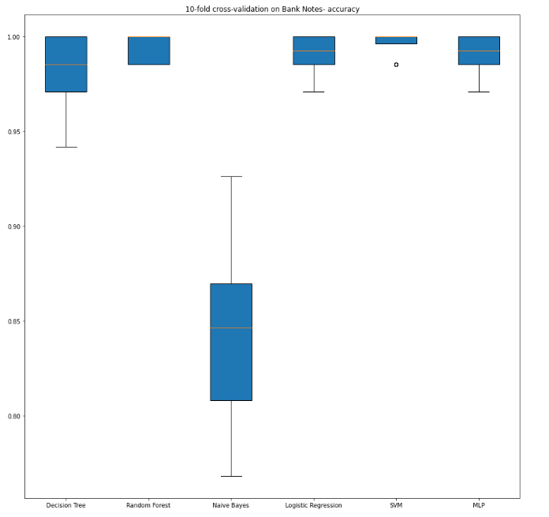

*Figure*  18 Bank Notes: DT ROC*

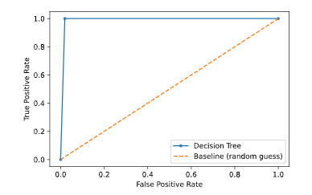

*Figure*  19 Bank Notes: RF ROC*

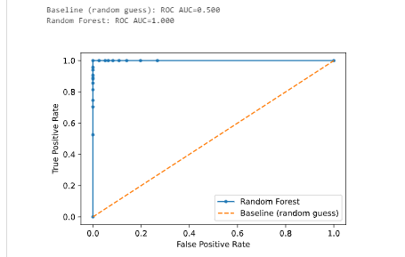

*Figure*  20  Bank Notes: NB ROC*

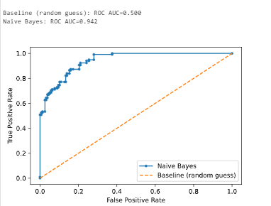

*Figure*  21  Bank Notes: LR ROC*

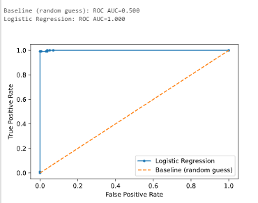

*Figure*  22  Bank Notes: SVM ROC*

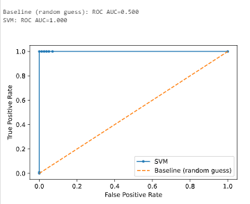

*Figure*  23  Bank Notes: MLP ROC*

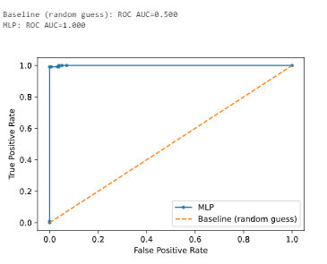

## Start-ups

Figure 24 shows a summary of the performance metrics for each of the 6 classifiers. On the whole this dataset has a significant fall in performance of classifiers. Although NB, LR, SVM and MLP are able to achieve almost 86% accuracy and seemingly perfect recall for class 1, the other metrics suggest that these scores are not enough to indicate strong or even better performance than the other classifiers. Despite the lowest accuracies, DT and RF (comparison of accuracies shown in Figure 25)  produce the highest averages for the other metrics. This highlights the misleading nature of accuracy when applied to imbalanced data. NB, LR, SVM and MLP are biased to the dominant label and as a result although they may produce some relatively strong performance metrics they are not deemed to perform strongly. As for DT and RF, although they are able to identify some of the other classes more successfully their performance on this dataset is also weak. None of the models are ready for deployment in this domain. Further on reflection this dataset is may not be a good choice for modelling due to its misrepresentation of successful Start-Ups. Despite making up the majority of this dataset, operating Start-Ups are far outweighed by unsuccessful (closed) Start-Ups in the real-world.

*Figure*  24  Start-Ups: Performance*

|Algorithm|Accuracy|Precision (0,1,2) **avg**|Recall (0,1,2) **avg**|F1-score (0,1,2) **avg**|
| :- | :- | :- | :- | :- |
|DT|76.67%|0.08,0.86,0.14 **0.36**|0.07,0.87,0.13 **0.36**|0.08,0.87,0.14 **0.36**|
|RF|82.65%|0.08,0.86,0.16 **0.37**|0.02,0.95,0.06 **0.35**|0.03,0.90,0.09 **0.34**|
|NB|85.87%|0.00,0.86,0.08 **0.31**|0.00,1.00,0.00 **0.33**|0.00,0.92,0.00 **0.31**|
|LR|85.96%|0.00,0.86,0.00 **0.29**|0.00,1.00,0.00 **0.33**|0.00,0.92,0.00 **0.31**|
|SVM|85.96%|0.00,0.86,0.00 **0.29**|0.00,1.00,0.00 **0.33**|0.00,0.92,0.00 **0.31**|
|MLP|85.96%|0.00,0.86,0.00 **0.29**|0.00,1.00,0.00 **0.33**|0.00,0.92,0.00 **0.31**|

*Figure*  25 Start-Ups: Box Plots*

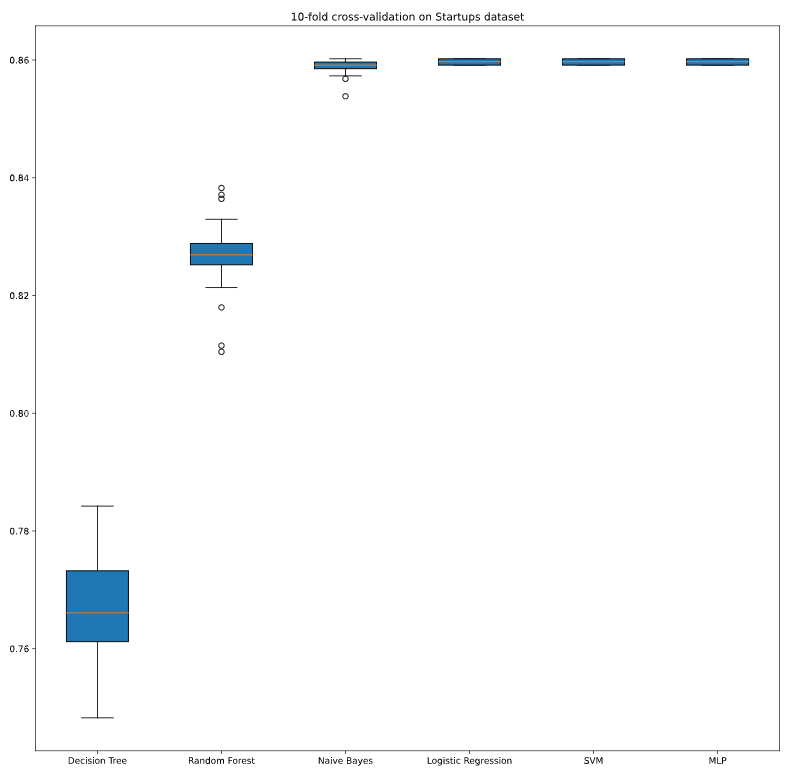

Although it was not possible to demonstrate some of the differences that had been aimed for, some key lessons for Machine learning and Data Mining were still highlighted. The difficulties of imbalance of datasets was evident in the results for Start Ups. It has been shown that many methods can be misled into underfitting and simply assigning the dominant class to almost all the inputs. Further this demonstrated the need for several evaluation metrics as accuracy in the imbalanced situation was clearly not a good indication of performance. 

### References

S Chatterjee, 2017. *Good Data and Machine Learning*. [online] Available at: <https://towardsdatascience.com/data-correlation-can-make-or-break-your-machine-learning-project-82ee11039cc9>  [Accessed 12th June 2020]

MissingLink, 2020. *Perceptrons and Multi-Layer Perceptrons: The Artificial Neuron at the Core of Deep Learning.* [online] Available at:  <https://missinglink.ai/guides/neural-network-concepts/perceptrons-and-multi-layer-perceptrons-the-artificial-neuron-at-the-core-of-deep-learning/> [Accessed 12th June 2020]

Rajesh S. Brid, 2018. *Decision Trees - A simple way to visualize a decision.* [online] Available at: <https://medium.com/greyatom/decision-trees-a-simple-way-to-visualize-a-decision-dc506a403aeb> [Accessed 15th June 2020]

R Gandhi, 2018. *Naive Bayes Classifier.* [online] Available at: <https://towardsdatascience.com/naive-bayes-classifier-81d512f50a7c> [Accessed 15th June]

S Ray, 2017. *6 Easy Steps to Learn Naive Bayes Algorithm with codes in Python and R.* [online] Available at: <https://www.analyticsvidhya.com/blog/2017/09/naive-bayes-explained/> [Accessed 15th June 2020]

R Gandhi, 2018. *Support Vector Machines - Introduction to Machine Learning Algorithms.* [online] Available at: <https://towardsdatascience.com/support-vector-machine-introduction-to-machine-learning-algorithms-934a444fca47> [Accessed 15th June 2020]

K P Shung, 2018. *Accuracy, Precision, Recall or F1?* [online] Available at: <https://towardsdatascience.com/accuracy-precision-recall-or-f1-331fb37c5cb9> [Accessed 15th June 2020]

